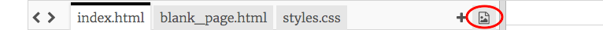
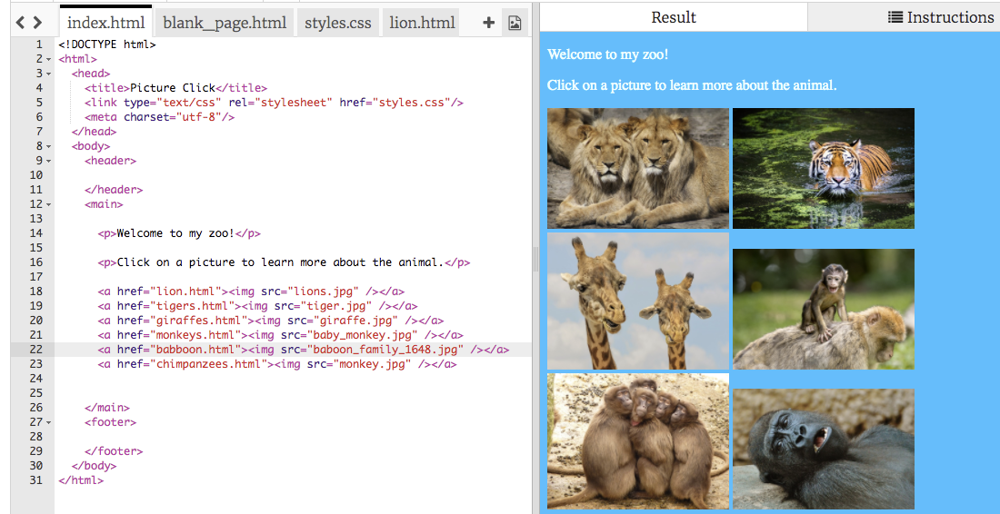

1. In this project you're going to make a zoo website! Go to [dojo.soy/mini-trinket](http://dojo.soy/mini-trinket) and click **Remix**. You will need to be signed in to Trinket. After you've clicked **Remix**, click the **Save** button.

2. Click on your username at the top right of the screen and select **My Trinkets**. Find the project you just created, called "WebPictures Remix", and click to open it.

3. In the **code pane** go to the tab `styles.css`. There you can see what colours will be used on the website. The text colour is `color` and the background colour is `background-color`. Change the values to colours that you like. For a list of colour names you can use, see [dojo.soy/mini-web-colours](http://dojo.soy/mini-web-colours).

4. For the next step you’ll need a picture of a zoo animal that you like. It needs to be saved on your computer. If you don’t have one handy, you can search the internet and download a picture, or even draw one.

5. Click the image icon to the right of the code tabs, then **Add Image**, then **Upload**, then **Click To Select Files**. Find the picture file on your computer, select it and click **Open**. Click **Done**.   
    

6. Now click on the `index.html` tab, and add the following line of code on a new line after the last `</p>` tag.

   ```html
        
   ```

   * Change `lions.jpg` to the filename of your picture. It must match the file name exactly. The picture should appear on your page.
   
7. If you want to change the size of your picture, go to `styles.css`. The rules for pictures are in the `img` block:
   ```css
      img {
        width: 200px;
      }
   ``` 
   Change the number after `width`. If you delete any of the other letters or symbols, be sure to type them back in! It should look like this: `width: 450px;`

8. Let’s turn it into a link that takes you to a page all about the animal! First, create a new page: click the **+** next to the image icon and type `lion.html` where it says **file name**.
   * You can change it to whatever animal you have, but be sure the name ends in `.html` as this is what makes it a **web page**.

9. Go to the file `blank_page.html`. There you'll see all the code you need for a blank page. Copy that into your new file.

10. To add a paragraph of text, click in the blank space between the`<main></main>`tags and type `<p></p>`. Type your text in between the tags, like this: `<p>This page is all about lions!!!!</p>`. You can add as many paragraphs like this as you want.
   * Try adding some pictures on this page too!

11. Go back to `index.html`. Find your image code and put it in between a pair of `<a></a>` tags like this:

   ```html
       <a href="lion.html"></a>
   ```
   Change `lion.html` to the name of the new page you created.

12. You just turned your picture into a link! You should be able to click on the picture now and see the page about that animal.

13. On a new line underneath your image and link code, write some more code to show another picture that links to another new page. Don’t forget to upload a file for your picture and create a new page! Add as many pictures and pages as you like. What animals are in your zoo?

14. Don't forget to click on **Save** every now and again to make sure you don't lose any of your work.  
 
To learn how to do more with your website and earn yourself a digital badge, visit <b>http://dojo.soy/mini-html-begin</b> and try the Beginner HTML CSS <br />Sushi Cards! To see this card online or print out more, go to <b>http://dojo.soy/mini-sushi-html</b> 



